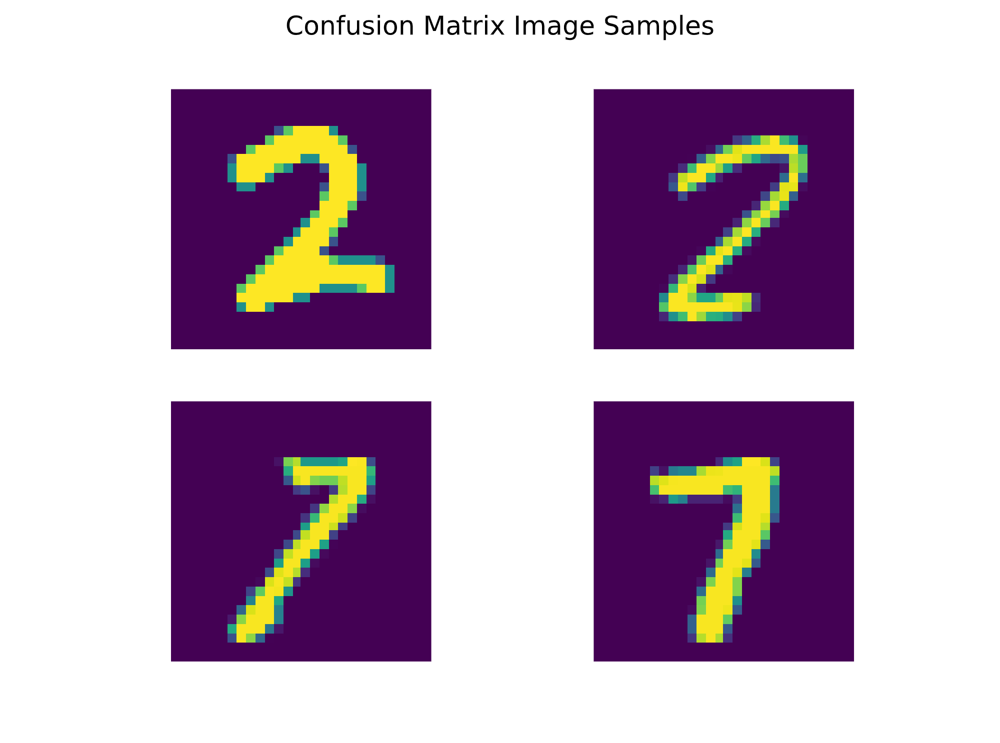
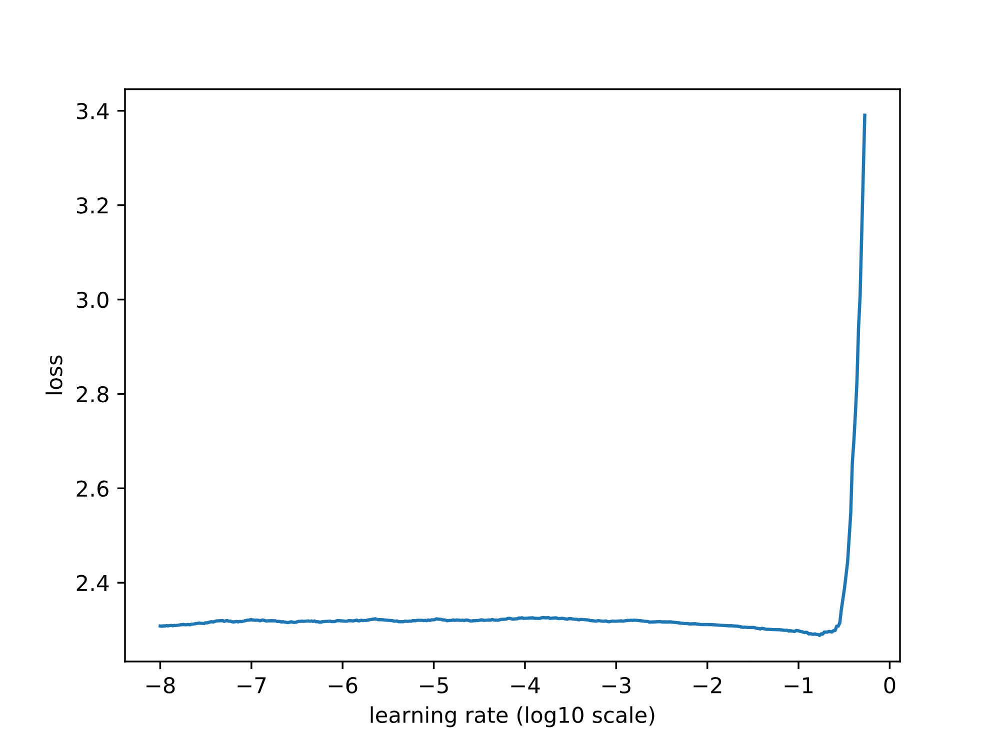
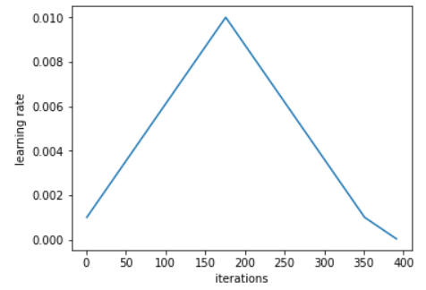
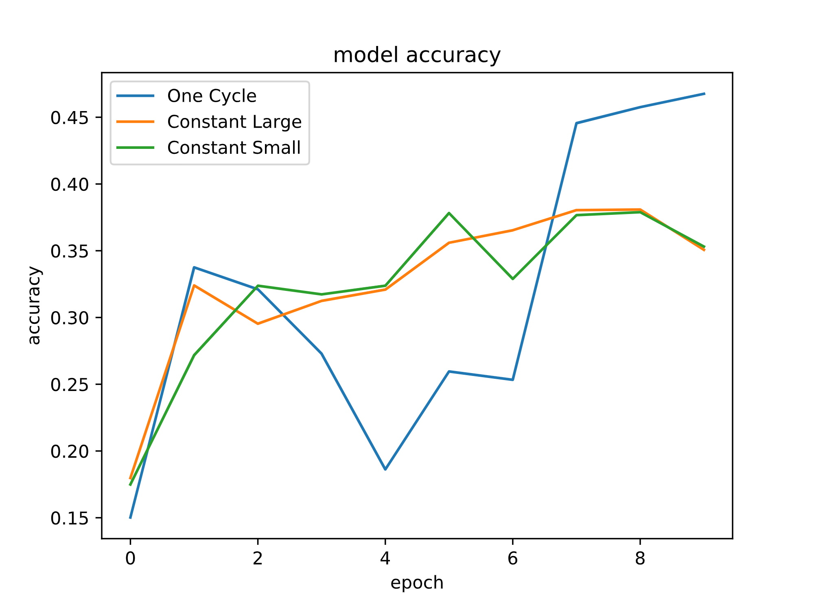

# Report
## One

In directory one, I designed and implemented a basic deep learning library that supports dynamic creation of computational graphs, and automatic differentiation. This library is inspired by PyTorch, my favorite deep learning library.

This library uses NumPy for its tensor operations. Furthermore, I use the pandas library for data loading and the matplotlib library for creating plots.

Currently, the library supports

* **Layer:** linear fully connected layer, RELU activation, Dropout  
* **Initialization**: Kaiming  
* **Loss:** binary cross entropy  
* **Optimizer**: Basic Stochastic Gradient Descent (SGD)  
* **Metric**: Accuracy  
* **Data Loader**: CSV data loader for classification

Using this library, I conducted the following experiment on MNIST dataset.

First we create a sequential model with two layers: A first layer consisting of a fully connected linear layer that with 784 inputs and 100 output, RELU activation and a Dropout with a dropping probability of 0.2; A second layer consisting of a linear layer with 100 inputs and 1 output. This model is simple and most probably does not need a Dropout for regularization, but we have added it as a proof of concept of the functionality of the library. The syntax to describe this model is

    model \= Sequential(  
        \[  
            Linear(784, 100),  
            Dropout(0.2),  
            Relu(),  
            Linear(100, 1\)  
        \]  
    )

Next, we use a binary cross entropy loss which automatically applies a Sigmoid function to its input before calculating the loss. Numerical stability was the reason that we combined the Sigmoid function with the loss, because Sigmoid function applies a exp to its input, which is susceptible to overflow/underflow both in its values and gradients, but the cross entropy applies a log to these values which make them stable. However, if we compute the log after computing the Sigmoid, the overflow/underflow have already occured. So we calculate the effect of log exp in one step.

Then, we train the model on the MNIST dataset. We only focus on the data with label 2 and 7, which could look similar in some handwritings. We use 10% of the training data for cross validation. We use accuracy as the metric of evaluation. In the interest of time, we make the experiment simple by using the basic stochastic gradient descent optimization algorithm, which only has one hyperparameter. Furthermore, we train the model for only 10 epochs, where each epoch consists of going through the whole training data once. The epoch with the best validation accuracy was the last epoch, with the following loss and accuracies.

epoch: 9, train\_loss: 0.493, train\_metric: 0.910, val\_metric: 0.907

This model has the following test accuracy.

Test metric: 0.918

The result has the unusual property that the validation accuracy is higher than training accuracy. We might think that this is because the validation set is small, resulting in high variance in estimation of validation accuracy, but increasing the validation set by 3 times did not change the result. The reason could be that our model is very simple, the number of epochs we train is small, and we add Dropout to the model; all resulting in a highly biased model. As a result, all train/val/test accuracies are close to each other, and small random fluctuations can result in reversing the ordering between train/val/test accuracies.

Afterwards, we calculate the confusion matrix on the test data. In the first row, the correct label is 2, and in the second row, the correct label is 7\.

Test data confusion matrix:  
\[\[0.47158815 0.02962603\]  
 \[0.05536668 0.44341914\]\]

We see that the model made more mistakes on 7s compared to 2s. This might be attributed to the fact 2s in most handwritings has a dent in its bottom which makes detecting most 2s easier. This statement is very speculative, and need further investigation.

In the end, we show one sample belonging to each cell of the confusion matrix.  

## two

In directory two, we implement a Lenet 5 using the Keras library and train it on the CIFAR 10 dataset. In order to select the learning rate and its schedule, we try the proposed method of Leslie N. Smith et al from “Super-Convergence: Very Fast Training of Neural Networks Using Large Learning Rates”.

We should note that we deviate from the original architecture of Lenet-5 proposed in “Gradient-based learning applied to document recognition” by Yann LeCun et al. In particular, in the original Lenet-5, the third has a symmetry breaking property, wherein each convolutional layer is connected only to 10 out of 16 outputs from the previous layer, in an unsymmetric manner. The authors had two reasons for this decision: first, to decrease the number of parameters of the model to make the model more computationally efficient; second, to encourage learning of more diverse features. This paper is from 1998 and in light of progress made till now, we should re-examine these reasons. Moderns deep learning libraries like Keras, are designed with having specialized hardware (GPU, TPU, etc) for efficient matrix computations in mind, and as a result, implementing these asymmetrical connectivities in them makes computations actually less efficient. Regarding the asymmetry argument, we can argue that using these more efficient specialized hardware, we can implement much larger neural networks with high capacity, and to avoid overfitting, we actually do not want to get very close to the minima of the objective function, while the asymmetrical connectivity could be thought of as a special architecture that has a simpler objective landscape which helps the optimization algorithm to get closer to its minima. 

In the interest of time, we only use 30% of the training data from the CIFAR 10 dataset; use the basic SGD algorithm, which only has 1 hyperparameter; use only 10 epochs of training. We use 30% of the training data for validation.

The idea of the proposed method from “Super-Convergence: Very Fast Training of Neural Networks Using Large Learning Rates” for setting the value of learning rate could be divided into two phases. For the sake of brevity, we refer to the method by one cycle policy.

In the first phase, we run training for 1 epoch, starting from a very small learning rate, and between every batch, we increase the learning rate by a constant, so that on the last batch, we would have a very large learning rate. In our experiment, the training loss versus as we were increasing the learning rate looked as follows.  
 
We pick a learning rate near the minima of the plot, but a little smaller, since at this learning rate the model has already started getting worse.

In the second phase, we actually use this learning rate to train the mode. However, instead of using a fixed learning rate, in the first half of the training, we start from a smaller learning rate, and linearly increase it until in the middle it reaches the learning rate found from the first phase, then again we linearly decrease it to reach the learning rate that we started. Leslie N. Smith et al, also proposes further decrease in the learning rate in the end, but in the interest of time, we do not implement it. Hence the learning rate in each training epoch would look like this   
  
source: [https://sgugger.github.io/the-1cycle-policy.html](https://sgugger.github.io/the-1cycle-policy.html)

The rationale behind this heuristic schedule on training is that the learning rate found from the first phase might be too large and we need to use a smaller learning rates, but if we use the large learning rate in the middle, it helps to jump from sharp minimas, which has bad generalization ([https://www.inference.vc/everything-that-works-works-because-its-bayesian-2/](https://www.inference.vc/everything-that-works-works-because-its-bayesian-2/)), and once we have jumped from them, we decrease the learning rate again, to converge to the minima of an area that is hopefully not sharp.

To see the effectiveness of the one cycle policy, we also train two separate models with constant learning rates. The first model uses the largest learning rate that we used in one cycle policy (the learning rate in the mid epoch), and the second model uses the smallest learning rate that we used in the one cycle policy (the learning rate in the first and last epoch). We see that even in 10 epochs, the method obtains better accuracy on validation data.  
 
